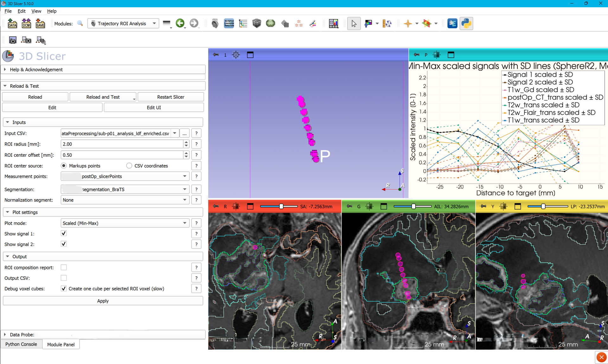

# Trajectory ROI Analysis

Trajectory ROI Analysis is a 3D Slicer extension for quantitative analysis along point-based trajectories.

For each trajectory point, the module creates spherical regions of interest (ROIs) along biopsy or measurement trajectories, identifies all voxel centers located inside the sphere, computes descriptive voxel-based statistics, and exports the results to a CSV file. Additional functionality includes evaluation of segmentation overlap, export of quantitative results, and visualization of image and signal intensity profiles along the trajectory.




---

# Main Features

* Spherical ROI generation with user-defined radius
* ROI centers from:
  * Markups Fiducial points
  * CSV coordinates
* Optional ROI center offset along trajectory direction
* MRI intensity quantification
* Segmentation overlap analysis
* Tissue-class assignment
* Segment-based normalization
* CSV export
* ROI composition reports
* ROI visualization in 2D and 3D
* Min-Max plots
* Dual Y-axis plots
* Z-score plots


The module is available under:

```text
Quantification > Trajectory ROI Analysis
```
---

# Supported Formats
The extension supports:

* Markups-based trajectory points
* CSV-defined ROI coordinates
* Multiple MRI modalities
* Segmentation-based tissue classification
* Intensity normalization
* Trajectory profile visualization

---

# Requirements

## 3D Slicer

Trajectory ROI Analysis requires:

* 3D Slicer
    * Recommended: 3D Slicer 5.10 or newer
    * Extension tested with 3D Slicer 5.10.0

The extension uses modern Slicer APIs including:

* Parameter Node Wrapper
* MRML Plot infrastructure
* Segmentation export APIs
* NumPy-based volume processing


---

## Python

Trajectory ROI Analysis requires:

* Python 3.12+

A compatible Python version is already included with supported Slicer releases.
Extension was tested with Python 3.12

---

## Included Dependencies

The following components are included with standard Slicer installations:

* NumPy
* VTK
* Qt
* Markups module
* Segmentations module
* Models module
* Plots module
* Subject Hierarchy module

No additional installation is required.

---

## Optional Dependency: Matplotlib

Matplotlib is only required for:

```text
Two Y axes (raw)
```

plot visualization.

All other functionality remains available without Matplotlib.

Install Matplotlib inside the Slicer Python environment:

```python
slicer.util.pip_install("matplotlib")
```

Restart Slicer after installation.

---

## Supported Operating Systems

* Windows 

Extension was only tested on Windows

---

# Installation

## Install from Source

Clone the repository:

```bash
git clone https://github.com/valga864/SlicerTrajectoryROIAnalysis.git
```

In Slicer:

```text
Edit → Application Settings → Modules → Additional Module Paths
```

Add the module directory and restart Slicer.

---

# Quick Start

1. Load spatially registered MRI volumes.
2. Open Trajectory ROI Analysis.
3. Select the input CSV.
4. Select ROI center source:
   * Markups points
   * CSV coordinates
5. Set ROI radius.
6. Optionally select:
   * segmentation
   * normalization segment
   * ROI offset
7. Configure plotting options.
8. Click Apply.
9. Review:
   * output CSV
   * ROI segmentation
   * ROI models
   * plots
   * composition report

---

## Documentation

For detailed usage instructions, CSV specifications, ROI generation,
segmentation analysis, normalization, plotting options, and output formats,
see:

[USER_GUIDE.md](USER_GUIDE.md)

---

# Citation

If you use this extension in academic work, please cite:

```text
Gäumann V. (2026).
Trajectory ROI Analysis:
A 3D Slicer Extension for Trajectory-Based MRI Quantification.
GitHub repository.
https://github.com/valga864/SlicerTrajectoryROIAnalysis
```

---

# License

This project is released under the MIT License.

See:

```text
LICENSE.txt
```

for details.

---

# Safety and Privacy

Trajectory ROI Analysis runs entirely locally inside 3D Slicer.

The extension:

* does not transmit data
* does not access external services
* does not download external binaries

Users are responsible for handling medical image data according to applicable privacy and ethics regulations.

---

# Contact

**Valentina Gäumann**

Trajectory ROI Analysis was developed as part of a Bachelor's thesis project.

The extension is provided as-is and is not currently under active maintenance or development.

For questions regarding usage, maintenance, or future development, please contact:

**Elisabeth Klint**
Department of Biomedical Engineering, Linköping University

Support:

* 3D Slicer Community Forum: https://discourse.slicer.org/

